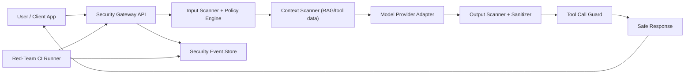

# LLM Security Gateway + Red-Team CI MVP Blueprint

## Why this MVP

Your two Lakera PDFs point to a repeated pattern:

- Prompt injection (`LLM01`) is the entry point.
- Insecure output handling (`LLM02`) turns model output into frontend compromise and data exfiltration.
- Poisoned upstream data (`LLM03`) corrupts agent behavior and downstream decisions.

The highest-leverage first build is:

1. A **runtime security gateway** in front of all LLM calls.
2. A **red-team CI harness** that continuously tests attack coverage and blocks risky releases.

## Assumptions

- Greenfield implementation.
- Primary stack: TypeScript.
- Web app + API service deployment.
- You want fast, practical controls over research-grade detection.

## MVP Outcomes (2 weeks)

- Every LLM request/response passes through one policy-enforced gateway.
- Known prompt injection patterns are detected, scored, and either blocked, challenged, or sanitized.
- Output is rendered safely (no executable HTML/JS, no stealth tracking pixels).
- Tool calls require policy checks and user confirmation for risky actions.
- CI runs attack suites (prompt injection, jailbreak, obfuscation, poisoning patterns) and fails builds on regression.

## Architecture (MVP)



## Components and Responsibilities

| Component | What it does | Must-have controls |
|---|---|---|
| Security Gateway API | Single entrypoint for all LLM traffic | Authn/Authz, rate limits, request IDs, tamper-evident logs |
| Input Scanner | Detects direct/jailbreak/sidestep/multi-step/obfuscation attempts | Regex signatures + heuristics + model-based validator |
| Context Scanner | Scans retrieved docs, emails, DB text, tool results before prompt assembly | Hidden instruction detection, trust labels, source allowlists |
| Policy Engine | Converts risk score + context into action | `allow`, `sanitize`, `challenge`, `block`, `human_review` |
| Model Adapter | Calls LLMs behind a provider abstraction | Timeouts, retries, provider isolation, per-model policy |
| Output Scanner + Sanitizer | Prevents XSS/tracking/data leaks in model output | HTML sanitization, URL allowlists, markdown image restrictions |
| Tool Call Guard | Prevents confused deputy and high-risk actions | Scoped permissions, argument validation, user confirmation |
| Event Store + Dashboard | Security observability and triage | Structured events, alerting thresholds, replay IDs |
| Red-Team CI Runner | Runs adversarial test suites pre-merge/deploy | Security regression gate in CI |

## Request Lifecycle

1. Client sends `POST /v1/secure-chat`.
2. Gateway normalizes input and computes metadata (user role, tenant, source trust).
3. Input scanner assigns signals (`prompt_override`, `roleplay_bypass`, `token_smuggling`, etc.).
4. Context scanner processes external context chunks and flags suspicious instructions.
5. Policy engine calculates risk score and decides action:
   - `allow`
   - `sanitize` (strip dangerous content)
   - `challenge` (ask user confirmation)
   - `block`
   - `human_review`
6. Model adapter sends approved prompt to provider.
7. Output scanner sanitizes markdown/HTML/links/media.
8. Tool calls are re-checked with least privilege + approval rules.
9. Safe response + decision metadata returned; events logged.

## Threat-to-Control Mapping (from your PDFs)

| Threat class | MVP control |
|---|---|
| Direct override (`ignore previous instructions`) | Signature + pattern detection + high-risk block |
| Jailbreak and role-play bypass | Heuristic + semantic classifier + challenge/block policy |
| Sidestepping and multi-prompt leakage | Conversation-level memory guardrails + cumulative risk scoring |
| Multilingual evasions | Language detection + translated re-check path |
| Token smuggling/obfuscation | Deobfuscation transforms (base64/reverse/spacing) then rescan |
| Indirect injection via docs/email | Context scanner at ingestion and retrieval time |
| XSS in agent UI output | Strict output sanitization + CSP + no raw HTML rendering |
| Tracking pixel/data exfil in markdown | Block remote image URLs or proxy through safe media service |
| Data poisoning in upstream systems | Source trust labels + anomaly checks + human validation on sensitive decisions |
| Confused deputy via tool calls | Per-tool scoped tokens + mandatory confirmation on high-risk actions |

## Suggested Tech Stack

### Backend

- `Node.js + TypeScript + Express`
- `zod` for strict request/tool argument validation
- `helmet` for security headers
- `DOMPurify` (server-side compatible wrapper) for HTML sanitization
- `ioredis` for rate limiting and short-term signal cache
- `PostgreSQL` for event/audit storage

### Frontend Console (optional but useful in week 2)

- `Next.js` admin console for:
  - blocked/challenged events
  - false-positive triage
  - policy tuning

### CI

- GitHub Actions:
  - unit tests
  - adversarial suite
  - security regression score gate

## API Contract (MVP)

### `POST /v1/secure-chat`

Request:

```json
{
  "session_id": "sess_123",
  "user_id": "usr_42",
  "messages": [
    {"role":"user","content":"..."}
  ],
  "context": [
    {"source_id":"doc_9","trust":"external","content":"..."}
  ],
  "requested_tools": ["search_docs"]
}
```

Response:

```json
{
  "decision": "allow",
  "risk_score": 27,
  "signals": ["indirect_instruction_pattern"],
  "assistant_message": "...",
  "blocked_tools": [],
  "event_id": "evt_abc"
}
```

### `POST /v1/redteam/run`

Request:

```json
{
  "suite": "prompt_injection_core",
  "target_model": "gpt-4.1-mini",
  "fail_threshold": {
    "max_successful_attacks": 3,
    "min_detection_rate": 0.9
  }
}
```

Response:

```json
{
  "run_id": "run_20260223_001",
  "detection_rate": 0.93,
  "successful_attacks": 2,
  "status": "pass"
}
```

## Policy Model (Config-Driven)

`policy.yaml` example:

```yaml
risk_bands:
  low: [0, 29]
  medium: [30, 69]
  high: [70, 100]

actions:
  low: allow
  medium: challenge
  high: block

rules:
  - id: direct_override
    pattern: "(?i)ignore all previous instructions"
    score: 80
  - id: html_script_payload
    pattern: "(?i)<script|onerror=|javascript:"
    score: 90
  - id: tracking_pixel
    pattern: "(?i)!\\[.*\\]\\(https?://.*\\?.*message="
    score: 85
```

## Security Defaults (non-negotiable)

- Strict schema validation at every boundary.
- No raw HTML rendering in UI; sanitize allowlist only.
- CSP with strict `script-src` policy.
- Auth/session tokens in HTTPOnly secure cookies in production.
- Least-privilege credentials for tools and data sources.
- No secrets in logs; event payload redaction.
- Rate limits on chat, auth, and tool-call endpoints.
- Manual approval for destructive/high-impact tool actions.

## Data Model (minimum)

### `security_events`

- `event_id`
- `timestamp`
- `session_id`
- `user_id`
- `risk_score`
- `decision`
- `signals[]`
- `source_ids[]`
- `model`
- `latency_ms`

### `redteam_runs`

- `run_id`
- `suite`
- `commit_sha`
- `detection_rate`
- `successful_attacks`
- `status`

## Metrics and Go/No-Go Gates

### Runtime metrics

- Attack detection rate (online, against labeled eval traffic)
- False positive rate by tenant/endpoint
- Mean policy decision latency
- Tool-call block/challenge rates
- Sanitization intervention rate

### Release gates

- Block release if:
  - detection rate drops below threshold
  - successful attack count increases over baseline
  - output sanitizer bypass test passes unexpectedly (i.e., exploit succeeds)

## 14-Day Execution Plan

### Days 1-2: Foundation

- Create monorepo structure (`gateway`, `redteam-runner`, `policy`).
- Implement `POST /v1/secure-chat` pass-through with auth + logging.
- Add baseline middleware: `helmet`, rate limiting, input size limits.

Deliverable: working secured pass-through API with structured event logs.

### Days 3-4: Input Security Layer

- Add signature rules for direct/jailbreak/obfuscation primitives.
- Build risk scoring and decision engine (`allow/challenge/block`).
- Add context trust labels (`internal`, `partner`, `external`, `unknown`).

Deliverable: deterministic policy decisions with explainable signals.

### Days 5-6: Output and Tool Guarding

- Add output sanitizer for markdown/HTML/link/media handling.
- Block executable HTML/JS, external tracking pixel patterns.
- Add tool-call policy checks + user confirmation hooks for risky actions.

Deliverable: safe rendering and guarded tool execution path.

### Days 7-8: Context/Poisoning Defenses

- Build context scanner for retrieved docs/tool payloads.
- Add simple anomaly checks for poisoned fields (policy directives in data fields).
- Add human-review path for high-risk sensitive decisions.

Deliverable: indirect injection and poisoning checks before prompt assembly.

### Days 9-10: Red-Team CI Harness

- Build `redteam-runner` CLI/API.
- Import prompt injection/jailbreak/obfuscation test sets.
- Output standardized score report and fail/pass status.

Deliverable: repeatable security regression suite.

### Days 11-12: CI Integration + Tuning

- Wire harness into GitHub Actions and deploy pipeline gates.
- Add thresholds and baseline snapshot.
- Tune rules to lower false positives on benign traffic.

Deliverable: enforced security gate in CI.

### Days 13-14: Hardening + Launch Readiness

- Add dashboards and alerting.
- Write runbooks: incident response, rule rollback, emergency block mode.
- Conduct final end-to-end adversarial demo against known exploit patterns.

Deliverable: MVP ready for controlled production rollout.

## Team Roles (lean setup)

- 1 backend engineer: gateway + policy + scanner pipeline
- 1 security engineer: rule packs + adversarial corpus + CI gating
- 1 full-stack engineer: admin console + triage UX + observability

## Post-MVP (next 4-8 weeks)

- Multilingual semantic detector improvements.
- Tenant-specific adaptive policies and risk thresholds.
- Canary prompts/honeypot markers for silent exploitation detection.
- Automatic quarantine of suspicious context sources.
- Human feedback loop to retrain detectors and reduce false positives.

